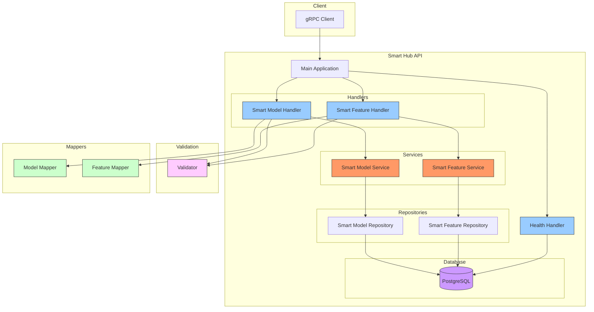

# 🌟 Smart Hub Service

Welcome to Smart Hub Service - A powerful, cloud-native microservice designed to manage smart devices and services efficiently!

## 🎯 Overview

Smart Hub Service is built with modern architecture principles to handle:

- 📱 **Smart Devices**: Manage various IoT devices like smart watches, cameras
- 🌐 **Smart Services**: Handle cloud services like weather forecasts, entertainment systems
- 🔌 **Feature Management**: Control and monitor device/service capabilities
- 🔄 **Protocol Support**: Multiple protocol integration (REST, gRPC, MQTT, WebSocket)
- 🗄️ **Persistent Storage**: Reliable PostgreSQL database integration
- 🔍 **Smart Search**: Find devices/services by name, identifier, type, or category
- 🚀 **Kubernetes Ready**: [Easy deployment with Kubernetes] [Kubernetes Docs](k8s/README.md)

## 📁 Project Structure

```
smart-hub/
├── cmd/                    # Application entrypoints
│   └── api/               # Main API service
├── internal/              # Private application code
│   ├── application/       # Application services
│   ├── domain/           # Domain models and interfaces
│   ├── infrastructure/   # External implementations
│   └── presentation/     # API handlers and mappers
├── proto/                # Protocol Buffers definitions
│   ├── health/          # Health check service
│   ├── smart_feature/   # Feature management
│   └── smart_model/     # Model definitions
├── tests/               # Integration tests
├── config/             # Configuration
└── migrations/         # Database migrations
```

## 🏛️ Architecture

### Why Clean Architecture?

The main reasons we chose Clean Architecture:

- 🎯 **High Testability**: Each layer can be tested independently
- 🔄 **Low Coupling**: Minimal dependencies between layers
- 🛠️ **Easy Maintenance**: Changes can be made in isolation
- 🔌 **Framework Independence**: Framework changes have minimal impact
- 📦 **Independent Deployment**: Microservices can be deployed independently

### Clean Architecture Layers

#### 1. 🎯 Domain Layer (`/internal/domain`)
- Heart of business logic
- Entities and core business rules
- No dependencies on other layers
- Interface definitions are here
- Example: `SmartModel`, `SmartFeature` entities

#### 2. 🔄 Application Layer (`/internal/application`)
- Contains use-cases
- Business logic orchestration
- Uses domain layer
- Uses interface implementations
- Example: `SmartModelService`, `SmartFeatureService`

#### 3. 🔌 Infrastructure Layer (`/internal/infrastructure`)
- Contains technical details
- Database, external services
- Repository implementations
- Example: `PostgresSmartModelRepository`

#### 4. 📡 Presentation Layer (`/internal/presentation`)
- API handlers (gRPC)
- Request/Response mapping
- Input validation
- Error handling
- Example: `SmartModelHandler`, `SmartFeatureHandler`

### System Architecture



## 🛠️ Technical Stack

### Core Technologies

  - **Go**: High-performance language for microservices
  - **gRPC**: Efficient RPC communication
  - **PostgreSQL**: Reliable relational database

### Development Tools & Libraries

#### 🔧 Core Libraries
- `google.golang.org/grpc`: gRPC implementation
- `github.com/jackc/pgx/v5`: PostgreSQL driver
- `github.com/golang-migrate/migrate`: Database migrations
- `github.com/google/uuid`: UUID generation
- `go.uber.org/zap`: High-performance logging

#### 🧪 Testing Tools
- `github.com/stretchr/testify`: Testing framework
- `github.com/pashagolub/pgxmock`: Database mocking
- `github.com/golang/mock`: Mock generation

## 🚀 Quick Start

### Detailed Kubernetes Setup and Configurations

- [Kubernetes Setup](k8s/README.md)


### Prerequisites

```bash
go version >= 1.23
docker >= 24.0.0
docker-compose >= 2.20.0
make
```

### One-Command Setup

```bash
# Start everything with Docker
docker-compose up -d

# Check logs
docker-compose logs -f
```

### Manual Setup

1. Clone the repository:
```bash
git clone https://github.com/yourusername/smart-hub.git
cd smart-hub
```

2. Create `.env` file:
```bash
# Required configuration
SERVICE_ENV=dev
SERVICE_PORT=50051
DATABASE_HOST=localhost
DATABASE_PORT=5432
DATABASE_USER=postgres
DATABASE_PASSWORD=postgres
DATABASE_DATABASE=smart_hub_db
LOG_LEVEL=DEBUG
```

3. Setup and run:
```bash
make setup      # Install tools
make proto      # Generate proto files
make run        # Run the service
```

## 📡 API Examples

### Creating a Smart Model

```go
client := pb.NewSmartModelServiceClient(conn)

resp, err := client.CreateSmartModel(ctx, &pb.CreateSmartModelRequest{
    Model: &pb.CreateSmartModelInput{
        Name:        "Smart Watch X1",
        Description: "Advanced fitness tracker",
        Type:        pb.ModelType_DEVICE,
        Category:    pb.ModelCategory_WEARABLE,
    },
})
```

### Adding a Feature

```go
resp, err := client.CreateSmartFeature(ctx, &pb.CreateSmartFeatureRequest{
    Feature: &pb.CreateSmartFeatureInput{
        ModelId:       modelID,
        Name:         "Heart Rate Monitor",
        Description:  "Real-time heart rate tracking",
        Protocol:     pb.ProtocolType_MQTT,
        InterfacePath: "/sensors/heartrate",
    },
})
```

## 🎯 Features

### 📱 Smart Models

Smart Model is our main building block that represents IoT devices or services.

#### Model Types
- 🔧 **Device Models**: Physical IoT devices
  - Smart Watch
  - Smart Camera
  - Smart Home Devices
  - IoT Sensors

- 🌐 **Service Models**: Cloud services
  - Weather Services
  - Entertainment Services
  - Data Processing Services
  - Analytics Services

#### Model Properties
```go
type SmartModel struct {
    ID           uuid.UUID              // Unique identifier
    Name         string                 // Model name
    Description  string                 // Detailed description
    Type         ModelType              // Device/Service
    Category     ModelCategory          // Wearable/Camera/Weather/Entertainment
    Manufacturer string                 // Manufacturer info
    ModelNumber  string                 // Model number/version
    Metadata     map[string]interface{} // Flexible additional data
    CreatedAt    time.Time             // Creation timestamp
    UpdatedAt    time.Time             // Last update timestamp
}
```

### 🔌 Smart Features

Smart Feature defines the capabilities and abilities that a Smart Model has.

#### Feature Protocols
- 🌐 **REST**: HTTP-based API endpoints
- 📡 **gRPC**: High-performance RPC calls
- 📨 **MQTT**: IoT messaging protocol
- 🔄 **WebSocket**: Real-time bi-directional communication

#### Feature Structure
```go
type SmartFeature struct {
    ID            uuid.UUID              // Unique identifier
    ModelID       uuid.UUID              // Associated model ID
    Name          string                 // Feature name
    Description   string                 // Feature description
    Protocol      ProtocolType           // Communication protocol
    InterfacePath string                 // API endpoint/topic
    Parameters    map[string]interface{} // Configuration parameters
    CreatedAt     time.Time             // Creation timestamp
    UpdatedAt     time.Time             // Last update timestamp
}
```

## 🧪 Testing

```bash
# Run unit tests
make test-unit

# Run integration tests (requires Docker)
make test-integration

# Run specific test
go test ./internal/domain/models/... -v
```

## 📚 Available Make Commands

```bash
make setup              # Install required tools
make proto              # Generate protobuf code
make test-unit          # Run unit tests
make test-integration   # Run integration tests
make all               # Run setup, proto and tests
make run               # Run the service
make clean             # Clean up generated files
```

## 🔧 Configuration

Key environment variables:

| Variable | Description | Default |
|----------|-------------|---------|
| SERVICE_ENV | Environment (dev/prod) | dev |
| SERVICE_PORT | gRPC server port | 50051 |
| DATABASE_HOST | PostgreSQL host | localhost |
| DATABASE_PORT | PostgreSQL port | 5432 |
| DATABASE_USER | Database user | postgres |
| DATABASE_PASSWORD | Database password | postgres |
| DATABASE_DATABASE | Database name | smart_hub_db |
| LOG_LEVEL | Logging level | DEBUG |

## 🚧 Known Issues

- [Github Issues](https://github.com/yldrmzffr/smart-hub/issues)